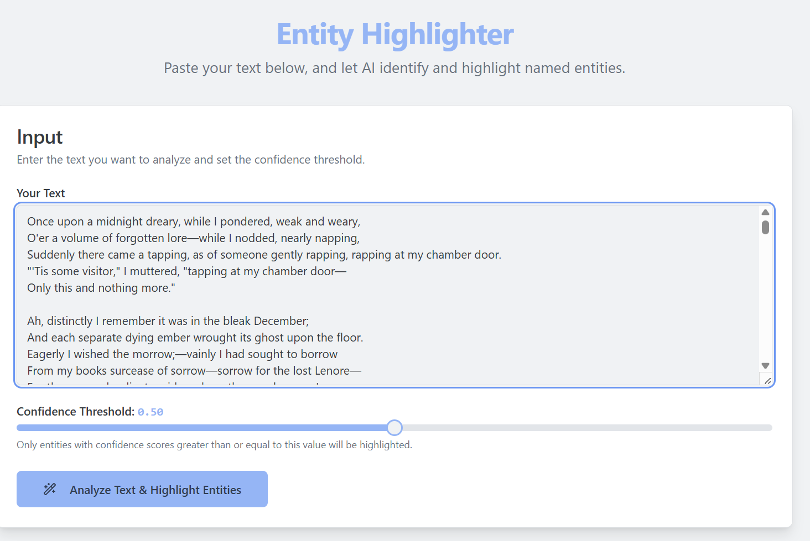
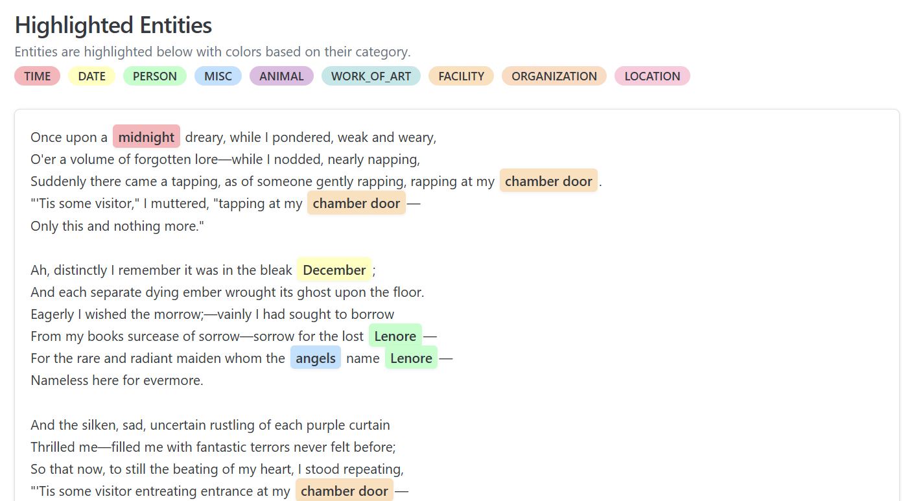

# Entity Highlighter (NER - Named Entity Recognition)

Entity Highlighter is a Next.js application designed to perform Named Entity Recognition (NER) on a given block of text. It identifies and categorizes entities (such as people, organizations, locations, etc.) and visually highlights them with distinct pastel colors corresponding to their categories. The app also allows users to filter entities based on a confidence score.

 


## Core Features

-   **Text Input**: A user-friendly interface with a text area to paste or type in the text for analysis.
-   **AI-Powered Entity Extraction**: Leverages Genkit AI flows to identify and categorize named entities within the provided text.
-   **Confidence-Based Filtering**: Users can adjust a confidence threshold to filter out entities with lower confidence scores, refining the NER results.
-   **Visual Entity Highlighting**: Detected entities are visually highlighted in the text. Each entity category is assigned a unique pastel color for easy identification and differentiation.
-   **Responsive Design**: The application is designed to be responsive and work across various screen sizes.

## Tech Stack

-   **Next.js**: React framework for server-side rendering and static site generation.
-   **TypeScript**: Superset of JavaScript for type safety.
-   **Tailwind CSS**: Utility-first CSS framework for styling.
-   **Shadcn/ui**: Re-usable UI components.
-   **Genkit (with Google AI)**: AI framework used for the entity extraction and filtering logic.
-   **Lucide React**: Icon library.

## Getting Started

Follow these instructions to get a copy of the project up and running on your local machine for development and testing purposes.

### Prerequisites

-   Node.js (v18 or later recommended)
-   npm or yarn (or pnpm)

### Installation

1.  **Clone the repository**:
    ```bash
    git clone https://github.com/TheNoog/EntityHighlighter.git
    cd entity-highlighter 
    ```

2.  **Install dependencies**:
    Using npm:
    ```bash
    npm install
    ```
    Or using yarn:
    ```bash
    yarn install
    ```

3.  **Set up environment variables**:
    This application uses Genkit with Google AI. You'll need a Google AI API key. Create a `.env` file in the root of your project and add your API key:
    ```env
    GOOGLE_API_KEY=YOUR_GOOGLE_AI_API_KEY
    ```
    Ensure this key has access to the Gemini models used by the Genkit flows.

### Running the Development Server

1.  **Start the Genkit development server** (if you need to test/modify Genkit flows, typically runs on port 3400):
    ```bash
    npm run genkit:watch 
    ```
    This command watches for changes in your AI flows. For this application, the flows are pre-built, so this step might be optional if you are not modifying them.

2.  **Start the Next.js development server** (typically runs on port 9002 as configured in `package.json`):
    ```bash
    npm run dev
    ```

Open [http://localhost:9002](http://localhost:9002) with your browser to see the application.

## How to Use the App

1.  **Navigate to the App**: Open the application in your web browser.
2.  **Input Text**: Paste or type the text you want to analyze into the "Input Text" area.
3.  **Adjust Confidence Threshold (Optional)**: Use the slider to set a minimum confidence score (0.0 to 1.0) for entities to be highlighted. A higher threshold means only entities with high confidence will be shown. The default is 0.5.
4.  **Analyze Text**: Click the "Analyze Text & Highlight Entities" button.
5.  **View Results**: The text will be displayed in the "Highlighted Entities" section below, with recognized entities highlighted in different pastel colors based on their category. If the process is ongoing, a loading indicator will be shown. Any errors during the process will be displayed as a notification.

## Building for Production

To build the application for production, run:
```bash
npm run build
```
This command creates an optimized build of your application in the `.next` folder.

## Deployment

You can deploy your Next.js application to various platforms. Here are a few common options:

### Vercel

Vercel is the creator of Next.js and provides seamless deployment.
1.  Push your code to a Git repository (GitHub, GitLab, Bitbucket).
2.  Sign up or log in to [Vercel](https://vercel.com).
3.  Import your Git repository. Vercel will automatically detect that it's a Next.js project.
4.  Configure environment variables (like `GOOGLE_API_KEY`) in the Vercel project settings.
5.  Deploy.

### Netlify

Netlify is another popular platform for deploying web applications.
1.  Push your code to a Git repository.
2.  Sign up or log in to [Netlify](https://netlify.com).
3.  Create a new site from Git.
4.  Select your repository. Netlify usually autodetects Next.js settings.
5.  Configure build settings if needed (e.g., publish directory is `.next`).
6.  Add environment variables in Netlify's site settings.
7.  Deploy.

### Firebase Hosting

If you are using other Firebase services, Firebase Hosting can be a good option.
1. Install Firebase CLI: `npm install -g firebase-tools`
2. Login to Firebase: `firebase login`
3. Initialize Firebase in your project: `firebase init hosting`
   - Select your Firebase project.
   - Configure as a single-page app: No (Next.js handles routing).
   - Set public directory: `.next` (though for dynamic Next.js apps, you'd typically use Firebase Functions or Cloud Run for the server part. For a static export, `.out` would be used). For full Next.js features, consider deploying the Next.js server to Cloud Run and routing via Firebase Hosting.
4. Add environment variables for server-side rendering if needed (e.g., in Cloud Functions/Run).
5. Deploy: `firebase deploy --only hosting`

### Other Platforms

You can also deploy Next.js applications to other platforms like AWS (Amplify, EC2/S3/CloudFront), Google Cloud (Cloud Run, App Engine), Azure (Static Web Apps, App Service), or your own server using Node.js. Refer to the Next.js documentation for more detailed deployment guides for various platforms.

## Project Structure

-   `src/app/`: Contains the main application pages and layout.
-   `src/components/`: Shared React components.
    -   `ui/`: Shadcn/ui components.
    -   `entity-highlighter-page.tsx`: Main client component for the app logic.
    -   `highlighted-text.tsx`: Component for displaying text with highlighted entities.
-   `src/lib/`: Utility functions.
    -   `utils.ts`: General utilities (like `cn` for classnames).
    -   `color-utils.ts`: Utilities for generating pastel colors for entity categories.
-   `src/ai/`: Contains Genkit AI flow definitions.
    -   `flows/`: Specific AI flows like `extract-entities.ts` and `filter-low-confidence-entities.ts`.
-   `public/`: Static assets.
-   `globals.css`: Global styles and Tailwind CSS setup.
-   `tailwind.config.ts`: Tailwind CSS configuration.
-   `next.config.ts`: Next.js configuration.

## Contributing

Contributions are welcome! Please feel free to submit a Pull Request.

1. Fork the Project
2. Create your Feature Branch (`git checkout -b feature/AmazingFeature`)
3. Commit your Changes (`git commit -m 'Add some AmazingFeature'`)
4. Push to the Branch (`git push origin feature/AmazingFeature`)
5. Open a Pull Request

---

This README provides a comprehensive guide to understanding, running, and deploying the Entity Highlighter application. If you encounter any issues or have suggestions, please open an issue in the repository.
